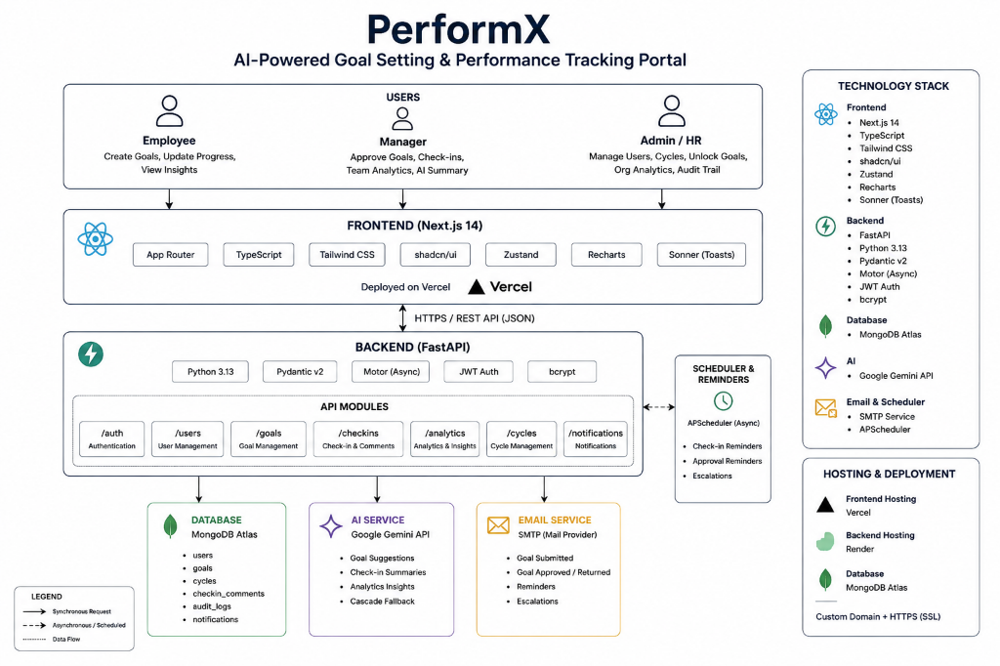

# ⚡ PerformX — Hackathon Submission
### AtomQuest Hackathon 1.0 — Atomberg Technologies
**Developer:** Rushikesh Swami (Full-Stack Developer)  
**Project:** PerformX (AI-Powered Goal Setting & Performance Tracking Portal)

---

## 🚀 Live Links & Assets

| Asset | URL |
|-------|-----|
| **Frontend Live Web App** | [https://frontend-cyan-alpha-15.vercel.app](https://frontend-cyan-alpha-15.vercel.app) |
| **Backend API Service** | [https://performx-syf8.onrender.com](https://performx-syf8.onrender.com) |
| **GitHub Repository** | [https://github.com/Swamii007/PerformX](https://github.com/Swamii007/PerformX) |
| **Interactive API Docs (Swagger)** | [https://performx-syf8.onrender.com/docs](https://performx-syf8.onrender.com/docs) |

> 💡 **Render Free Tier Warm-up:** The backend is hosted on Render's free tier. If the server has been inactive, it will sleep. The very first request (such as opening the login page or clicking sign-in) will automatically trigger a wake-up, which takes **20–30 seconds**. We have added a proactive wake-up ping that starts waking up the server the second you land on the login page!

---

## 🏗️ System Architecture

PerformX is built as a modern, decoupled full-stack application following professional monorepo standards. Below is the comprehensive architectural blueprint:

### Technology Stack
* **Frontend**: Next.js 14 (App Router), TypeScript, Tailwind CSS v4, Zustand (State Management), Recharts (Analytics Dashboard), Sonner (Toasts), Radix UI (Accessible components).
* **Backend**: FastAPI (Python 3.13), Motor (Async MongoDB Driver), Pydantic v2 (Data Validation), JWT (Authentication), aiosmtplib (Async Email).
* **Database**: MongoDB Atlas (Cloud Database).
* **AI Core**: Google Gemini 2.5 Flash API (with robust cascade fallback logic for zero-downtime offline mode).
* **Deployment**: Vercel (Frontend), Render (Backend).

---

## 🔑 Ready-to-Use Demo Credentials

To make evaluation seamless for judges, the system is fully seeded with realistic business data (7 users, 18 goals, 4 quarters of progress history, comments, and audit trails). 

You can log in **instantly** by clicking the **Quick Demo Access** buttons on the login page—no typing required!

| Role | Email | Password | Assigned Persona & Data State |
|------|-------|----------|-------------------------------|
| **Admin / HR** | `admin@performx.com` | `Admin@123` | **Priya Sharma** (Full org controls, cycle config, audit logs, pushes shared KPIs) |
| **Manager (Sales)** | `manager@performx.com` | `Manager@123` | **Rahul Mehta** (Approves/rejects Sales goals, leaves comments, uses AI review) |
| **Manager (Eng)** | `manager2@performx.com` | `Manager@123` | **Deepa Nair** (Manages Engineering team goals and check-ins) |
| **Employee (Sales)** | `employee1@performx.com` | `Employee@123` | **Ananya Patel** (Top performer, complete Q1+Q2 achievements, shared KPIs) |
| **Employee (Sales)** | `employee2@performx.com` | `Employee@123` | **Vikram Singh** (Underperforming, has draft/returned goals, has **At-Risk** indicators) |
| **Employee (Eng)** | `employee3@performx.com` | `Employee@123` | **Rohan Desai** (Software Engineer, pending task check-ins) |
| **Employee (Eng)** | `employee4@performx.com` | `Employee@123` | **Sneha Kulkarni** (Strong performer in the Engineering department) |

---

## 🌟 Key Features & Implementation Highlights

### 1. Robust Goal Workflow & Validation (BRD §2.1)
* **Smart Bounds**: Employees can create up to 8 goals per cycle. The system strictly enforces that the total weightage across all goals must equal **exactly 100%**, with a minimum of **10%** per goal.
* **Inline Adjustments**: Managers don't just approve or reject; they can **edit targets and weightages inline** during the review process.
* **Lock & Key Governance**: Approved goals are instantly locked. They can only be unlocked by an Admin, who must provide a mandatory reason that is permanently recorded in the **immutable Audit Log**.
* **Shared KPIs**: Admins and Managers can push unified organizational goals (e.g., "Achieve Department NPS of 80") to multiple employees simultaneously.

### 2. Multi-Formula Progress Automation (BRD §2.2)
The system automatically calculates quarterly progress scores utilizing 4 distinct Unit of Measure (UoM) formulas:
* **Numeric Min (Higher is Better)**: `(Achievement / Target) * 100` (e.g., Revenue targets).
* **Numeric Max (Lower is Better)**: `(Target / Achievement) * 100` (e.g., Bug rate reduction).
* **Timeline**: `100` if completed on/before target date, with a `-2%` penalty per day late.
* **Zero-Based**: `100` if actual value remains exactly `0`, else `0` (e.g., compliance/safety violations).

### 3. Integrated AI (Google Gemini 2.5 Flash)
* **Goal Assistant**: Helps employees draft well-defined goals based on their department, role, and thrust area.
* **Manager Co-Pilot**: Instantly summarizes multiple check-in comments for a goal per quarter.
* **Executive Summary**: Generates natural language insights on the Admin analytics dashboard to highlight top thrust areas and at-risk teams.
* *Fallback*: Zero-downtime offline cascade mode kicks in gracefully if API limits are reached.

---

## 🎯 Recommended 5-Minute Evaluation Walkthrough

Follow these steps to experience the complete workflow in minutes:

1. **Step 1: Check-in as Employee (Ananya)**
   * Log in as **Ananya Patel** (Employee).
   * Go to **My Goals** to see 5 approved goals, live score bars, and a **Shared KPI** badge.
   * Go to **Progress** to see her weighted performance score (86.1%), QoQ trend charts, and a radar chart.
2. **Step 2: Act as Manager (Rahul)**
   * Log in as **Rahul Mehta** (Manager).
   * Open the **Team Goals** page, find Vikram's pending "Reduce travel expenses" goal, click **Approve**, and try the **inline edit** to adjust his target or weightage before saving.
   * Go to **Check-ins**, select Ananya Patel (Q1), and click the **AI Summarize** button to let Gemini compile her check-in comments.
3. **Step 3: Access Admin Controls (Priya)**
   * Log in as **Priya Sharma** (Admin).
   * Open **Cycles** to see cycle phase gating (Goal Setting → Q1 Check-in → ... → Closed).
   * Go to **Analytics** to view the department heatmap, export the organization-wide data to Excel (**XLSX Export**), or click **Generate AI Insights** for an overall organizational performance audit.

---

*Thank you for evaluating PerformX. This platform delivers a production-grade, enterprise-ready performance management system built to modern standards.*
